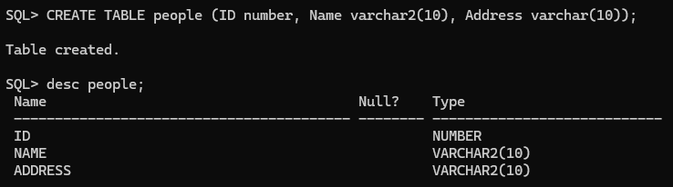
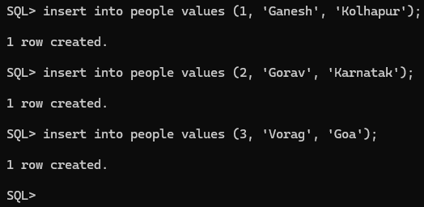
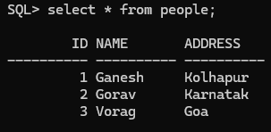
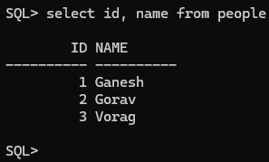
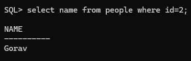
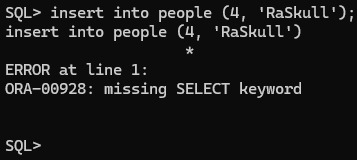
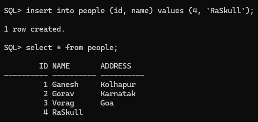

Conditions:

1. We create table in database using 'CREATE TABLE' command.  
2. Table name can be upto 30 char long.
3. Table name must begin with alphabet.
4. Table names can't contain single/double quotes.
5. Names are not case sensitive.
6. Names can cantain a-z, 0-9, _, $, #.
7. Names can't be reserved keywords.  

# Create Table:  
```sql
-- Syntax
CREATE TABLE table_name (
    col1 datatype [constraints],
    col2 datatype [constraints],
    .
    .
    .
    colN datatype [constraints]
);
```  
### Example: 
```sql
CREATE TABLE people (
    ID number,
    Name varchar2(10),
    Address varchar(10)
    );
-- no constraints applied here.
```  
### See table:  
```sql
-- syntax:
desc tableName;
```  
```sql
desc people;
```  
### Preview:  
  


# Insert:  
```sql
-- Syntax
INSERT INTO table_name VALUES (value1, value2, ..., valueN);
```  
### Example:  
```sql
insert into people values (1, 'Ganesh', 'Kolhapur');
insert into people values (2, 'Gorav', 'Karnatak');
insert into people values (3, 'Vorag', 'Goa');
```  
  

# Select:  
```sql
-- Syntax:  
select * from table_name;
```  
```sql
select * from people;
```  
  
```sql
select id, name from people;
```  
  
```sql
-- Where clause
select name from people where id=2;
```  
  


# Insert: skipping some values  
```sql
insert into people (4, 'RaSkull');
```  
  
the error occured because fields are 3 & record is uncomplete (2 columns only)  
but we can force SQL to do that too by this  
```sql
insert into people (id, name) values (4, 'RaSkull');
-- specifying only inserting fields
```  
```sql
select * from people;
```  
  
